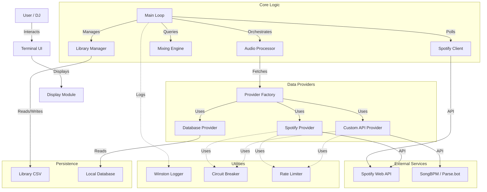

# System Architecture

## Overview

The Real-Time DJ Assistant is a Node.js application that integrates with Spotify and other APIs to provide real-time harmonic mixing recommendations.

## Architecture Diagram

## Components

- **Main Loop**: Orchestrates the application lifecycle, polling, and UI updates.
- **Spotify Client**: Handles authentication and polling current playback state.
- **Audio Processor**: Fetches and caches audio features (BPM, Key) for tracks.
- **Mixing Engine**: Calculates harmonic compatibility based on Camelot Wheel.
- **Providers**: Pluggable modules for fetching audio data from different sources.
- **TUI**: Renders the "Train Board" style interface.
